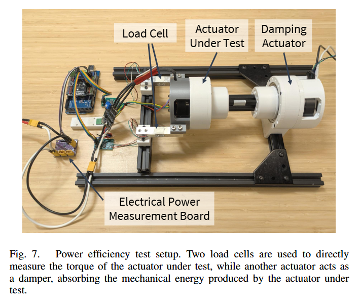
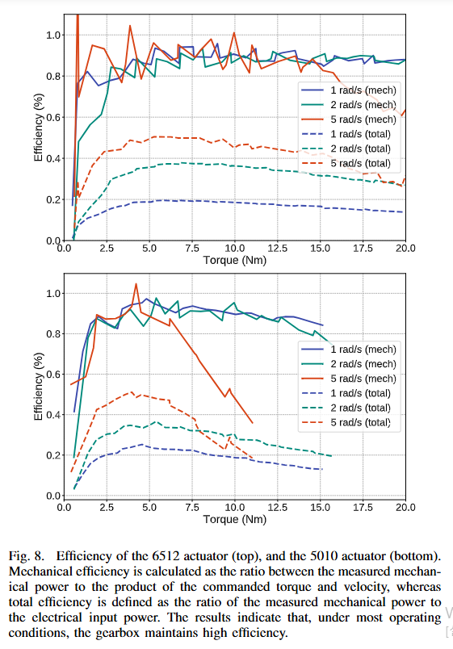
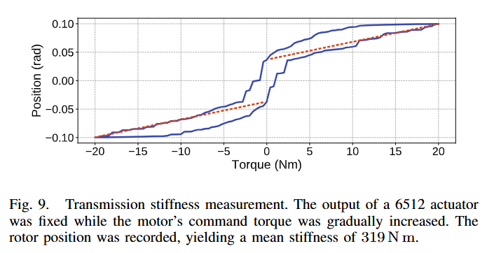

---
# Paper Review : "Demonstrating Berkeley Humanoid Lite: An Open-source, Accessible, and Customizable 3D-printed Humanoid Robot"
---
## What is this paper regarding?
This paper demonstrates accessible 3d-printed low-cost humanoid robot promoting democratization in humanoid robotics. The core design is a modular 3d-printed customizable actuator easily replaceable, preventing delays of an experiment from broken parts of robots. Also conduct experiments to validate reliability of 3d-printed actuator. Futhermore, It showcased zero-shot policy transfer from simulation to hardware, highlighting the platform's suitability for research validation.

  <table>
    <tr>
      <td></td>
      <!-- <td></td> -->
    </tr>
  </table>

## Key Contributions
- Low Cost Accessible Modular 3d-printed actuator
- Reliable Actuator Evaluation
- Zero-shot policy transfer from simulation to hardware

## Background of why I read this paper
This paper deals with 'low-cost', '3d-printed', 'modular actuator', 'zero-shot policy'. These properties are crucial for me planning to build humanoid robot in the near future. The robot has to be reliable for successful experiment of Reinforcement Learning(RL) in locomotion even it's based on low-cost 3d-printed actuator. Also It should be replaceable quickly to accelerate experiments.

I'm now focusing on building reliable robotic actuator to employ reinforcement learning successfully. In my prvious project, I have not conducted evaluation yet. Thus this paper is suitable for me, offering insights not only into actuator evaluation methods but also deploying reinforcement learning model on my assembled robots in future.

## Critical Thinking & Takeaway
#### 1. Accessible Low-Cost Actuator
The actuators are two different size(6512, 5010). As you can see below figures, It's relatively low cost compared to other metalic actuators. For example, 6512 actuator uses M6C12 150KV BLDC drone motor from MAD Components, as5600 encoder and B-G431B-ESC1 as a motor driver. The reducer, and housing parts are all 3d printed with PLA. The cycloidal gears are opted as reducer owing to it's high robustness. 

<table>
  <caption>BOM and Controller Components</caption>
  <tr>
    <td></td>
    <td></td>
  </tr>
</table>

<table>
  <caption>Encoder and Motor Components</caption>
  <tr>
    <td></td>
    <td></td>
  </tr>
</table>

<caption>M6C12 150kv BLDC Drone Motor Specification</caption>
<td></td>

As you can see in the motor specification figure,
- Motor Size : D:72 x 27mm
- Number of the poles : 14
- RPM/V : 150KV
- Maximum Current : 36.18A
- Maximum Torque : 2.64Nm
- Nominal Battery : 12S lipo($\approx$ 48V) 

#### 2 Actuator Evaluation - Efficiency
A reliable actuator is fundamental to the robot's overall performance. This paper conduct a set of experiments under conditions identical to those on the robot, including 24V power supply, indentical position PD gains, and matching position torque and current bandwidth 
configurations.
<td></td>

In the experiment, Actuator Under Test performs Torque(Torque Control) and Damping Actuator performs constant speed(speed control). Two load cells measure torque of the primary actuator. An electrical-power measurement board logged the supply voltage and current, from which electrical input power was calculated.

$$P_M = \tau_m \times \omega_m$$
where:
- $P_M$ : Mechanical Output Power
- $\tau_m$ : Measured Torque 
- $\tau_m$ : Measured Rotational Speed

Through these testset, Mechanical Output Power can be calculated 

$$M_{eff} = \frac{P_M}{\tau_c \times v_c} $$

where:
- $M_{eff}$ : Mechanical Efficiency
- $\tau_{c}$ : Commanded Torque
- $v_c$ : Commanded Velocity

Then **Mechanical Efficiency** can be calculated either which represents the **efficiency of 3d-printed reducer**.

$$T_{eff} = \frac{P_{measured}}{P_{input}} $$

where:
- $T_{eff}$ : Total Efficiency
- $P_{measured}$ : Measured Mechanical Power
- $P_{input}$ : Input Power

**Total efficiency** reflects the overall actuator
efficiency, which includes **motor copper losses, driver electrical losses, and mechanical losses.**

<td></td>

The experiment conducted the actuator performs  across three different speeds. Each torque and speed command was maintained for one second. As shown in Figure 8, the gearbox exhibits a mechanical efficiency of approximately 90% across most operating conditions. However, at high torque and velocity, efficiency decreases due to heat generation.

This dynamometer method is suitable for strict evaluation seperating mechanical efficiency and total efficiency. we can easily analyze contributions of mechanical impedance and electrical impedance which efficienct method to evaluate custom actuators and reducers.

#### 3. Actuator Evaluation - Transmission stiffness
<td></td>

The actuator’s transmission stiffness measured by rigidly fixing the output shaft relative to the actuator housing and measuring motor displacement under a range of static torques. 

The torque command was gradually ramped from 0 Nm to 20 Nm and back in both directions. A linear fit was then applied to the data collected from 4 Nm to 10 Nm, and the inverse of the slope yielded a stiffness of approximately 319.49 Nm/rad (Figure 9). The transmission stiffness can be compensated by opting alternative materials(e.g PA-CF).

#### 4. Actuator Evaluation - Durability

## Conclusion

---
## Reference
**Citation**: 

**Publication**: 

**NOTE:**

[Controller](https://www.st.com/en/evaluation-tools/b-g431b-esc1.html)

[Motor and Motor specification](https://store.mad-motor.com/products/mad-m6c12-eee-brushless-motor-for-the-long-flight-time-multirotor-hexacopter-octopter?srsltid=AfmBOopSIaIIfPpFTQoUzMsGxo3gZUvFAoL8lv4r6elfjP7InwBlftJ5)

[Encder](https://www.tinytronics.nl/en/sensors/magnetic-field/as5600-magnetic-angle-sensor-encoder-module)